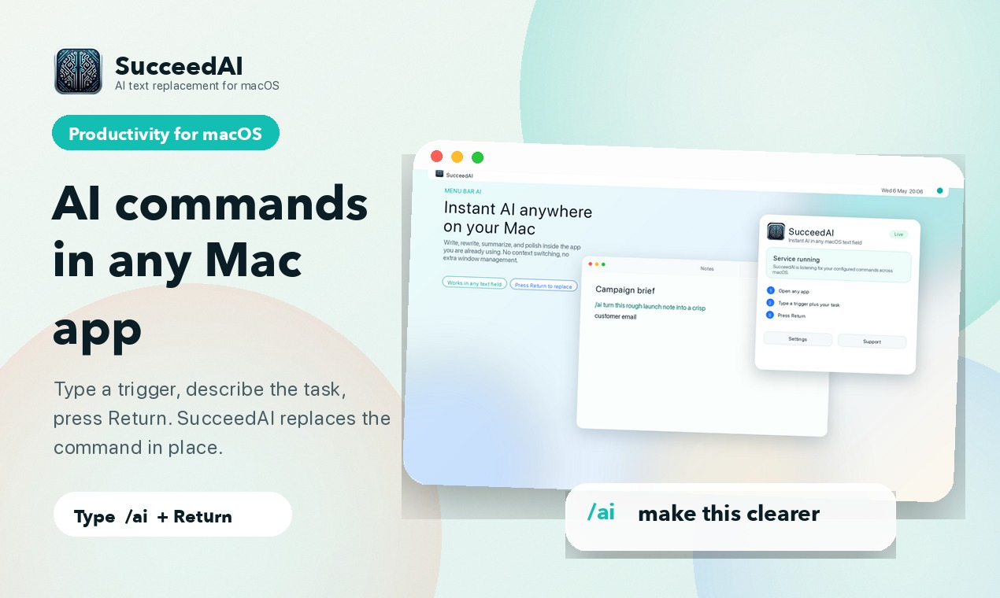
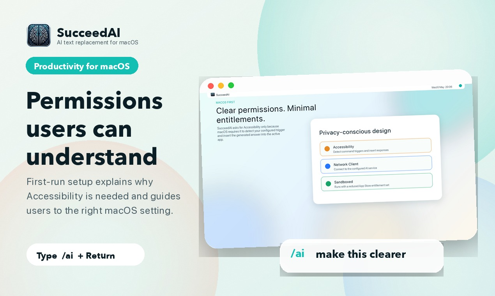
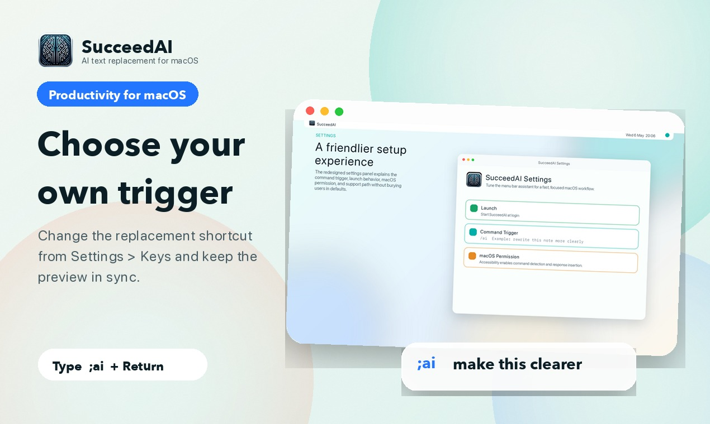

# SucceedAI - AI Writing Assistant for macOS

SucceedAI is an AI text replacement assistant for Mac. Type a configurable command in any editable macOS text field, describe what you need, press Return, and SucceedAI replaces the command with polished AI-generated text in place.



## Why It Exists

Most AI writing workflows force you to leave the app where the writing is happening:

1. Copy text from Mail, Notes, Slack, a browser, or a document.
2. Open a chatbot or AI editor.
3. Write a prompt.
4. Copy the result.
5. Paste it back.
6. Fix the flow you just interrupted.

SucceedAI removes that copy-paste loop. It brings AI writing directly into the active Mac text field.

## What You Can Do

- Rewrite emails so they are clearer, warmer, shorter, or more direct.
- Summarize notes into action items.
- Translate messages without opening another app.
- Draft support replies inside the browser or help desk you already use.
- Polish social posts, product copy, issue comments, release notes, and documentation.
- Customize the command trigger from the settings panel.

## How It Works

1. Open any app with an editable text field.
2. Type your SucceedAI trigger, such as `/ai`.
3. Describe the writing task.
4. Press Return.
5. SucceedAI replaces the command with the generated response.

Example:

```text
/ai rewrite this launch email so it is concise and friendly
```

## macOS Permission

SucceedAI needs Accessibility permission because macOS requires it for apps that detect global keyboard input and insert text into other apps. The app includes a guided permission setup and a Settings panel where users can check the permission state.



## Settings

The settings panel includes:

- Launch at login.
- Accessibility status and setup guidance.
- Replacement trigger customization.
- Version and support links.



## Product Hunt And Marketing Assets

Launch assets are available in:

- `ProductHunt/gallery/` - Product Hunt gallery images.
- `ProductHunt/icons/` - Product icons and thumbnails.
- `ProductHunt/social/` - Social and launch announcement images.
- `ProductHunt/brand/` - Light and dark logo lockups.
- `Marketing/` - SEO copy, App Store metadata, Product Hunt copy, launch checklist, outreach templates, and press kit.
- `docs/` - GitHub Pages landing site for `succeed.pierrehenry.dev`.
- `fastlane/` - macOS App Store metadata, screenshot upload, and release lanes.
- `ai-proxy-server/` - Railway-ready backend proxy for the macOS app.

## Get Started For Development

1. Rename `Succeed AI/Config.swift.dist` to `Succeed AI/Config.swift` and update the values.
2. Set up your local Xcode signing configuration:

   ```bash
   cp Local.xcconfig.dist Local.xcconfig
   ```

3. Open `Local.xcconfig` and replace `YOUR_TEAM_ID` with your Apple Developer Team ID.
4. Open the project in Xcode on macOS.
5. Build and run the `SucceedAI` scheme.

`Local.xcconfig` is git-ignored and keeps signing credentials out of source control. Never commit it. The committed template is `Local.xcconfig.dist`.

## Run Checks

```bash
xcodebuild -project 'Succeed AI.xcodeproj' -scheme SucceedAI -configuration Debug -destination 'platform=macOS' -only-testing:'Succeed AITests' test
xcodebuild -project 'Succeed AI.xcodeproj' -scheme SucceedAI -configuration Release -destination 'platform=macOS' build
```

## Generate Store And Launch Assets

```bash
python3 scripts/generate_app_store_screenshots.py
python3 scripts/generate_product_hunt_assets.py
```

The App Store screenshot generator writes both `AppStore/Screenshots/macOS/` and the Fastlane upload folder `fastlane/screenshots/en-US/`.

## Fastlane Release Checks

```bash
fastlane mac screenshots
fastlane mac verify_release_build
```

Use `fastlane mac upload_metadata` for App Store metadata and screenshots only. Use `fastlane mac release` after Apple signing credentials and App Store Connect authentication are configured.

## Backend Proxy

The macOS app defaults to the server proxy flow. The backend in `ai-proxy-server/` is configured for Railway and uses the OpenAI Responses API by default.

```bash
cd ai-proxy-server
npm install
npm run build
```

## Feedback

Open a GitHub Issue for bugs, product feedback, or workflow requests:

https://github.com/SucceedAI/macOS-Desktop-App/issues

## Author

Built by [Pierre-Henry Soria](https://ph7.me).
