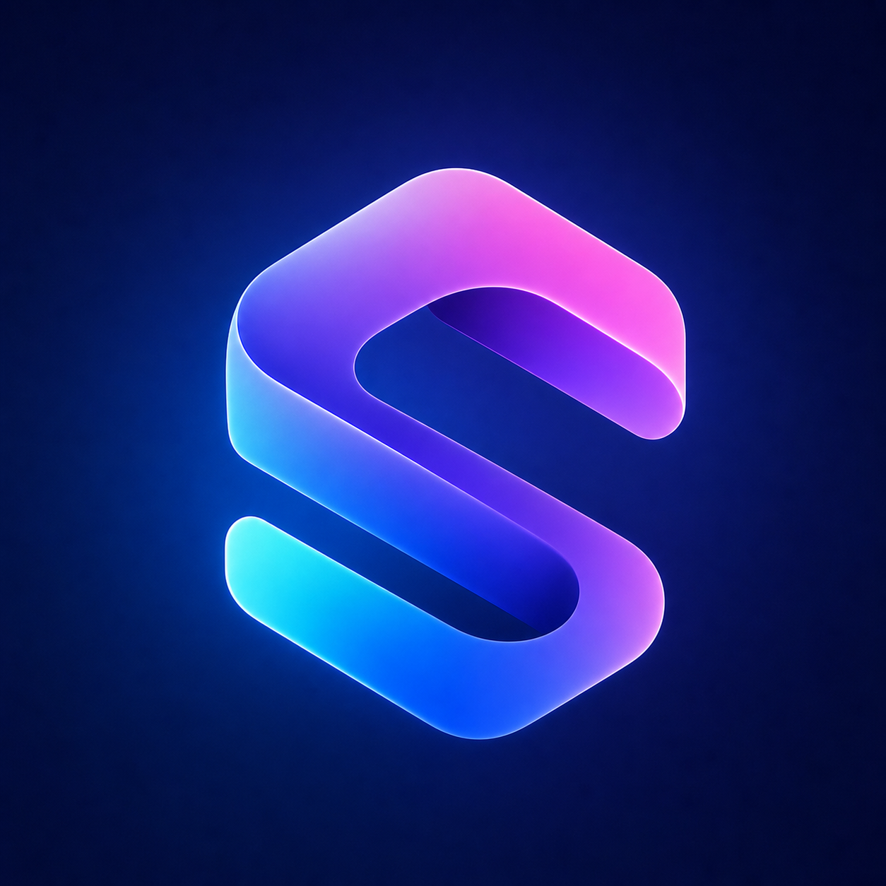
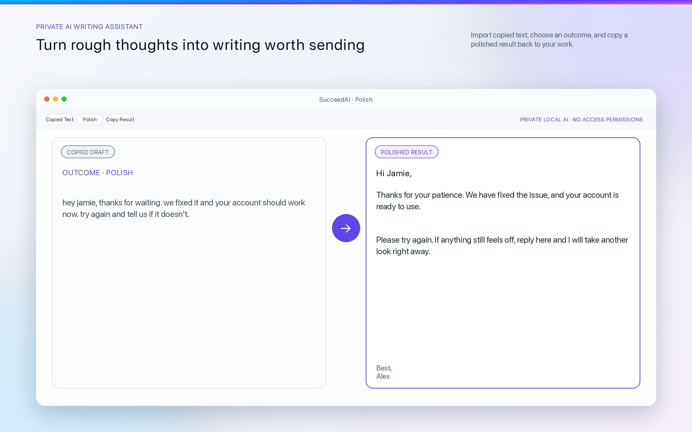
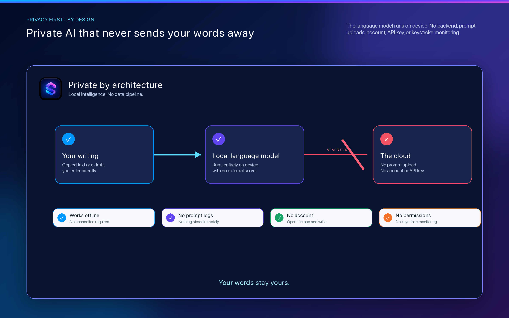
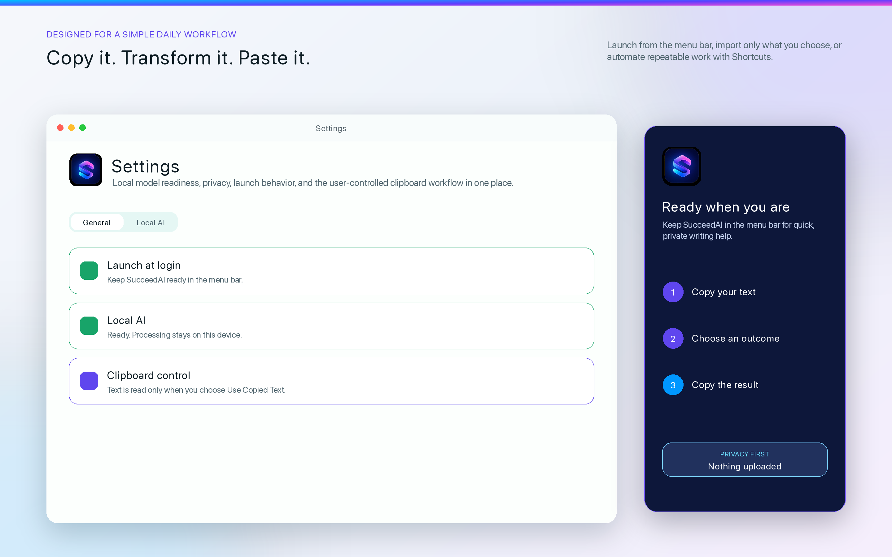

<p align="center">
  
</p>

# SucceedAI - Private AI Writing for iPhone, iPad, and Mac

SucceedAI is a **local AI writing assistant** powered by Apple’s **on-device** language model. It keeps your writing **private** and works **offline** once Apple Intelligence is ready. On macOS, copy the text you want to improve, choose **Use Copied Text**, select a practical outcome, and copy the finished result. On iPhone or iPad, write in the app, transform selected text in one tap with the optional keyboard, or type `/ai`, or your own trigger, directly on the SucceedAI keyboard and press AI Return. Prompts never need a SucceedAI server, account, or API key.



## Why It Exists

Most AI writing workflows force you to leave the app where the writing is happening:

1. Copy text from Mail, Notes, Slack, a browser, or a document.
2. Open a chatbot or AI editor.
3. Write a prompt.
4. Copy the result.
5. Paste it back.
6. Fix the flow you just interrupted.

SucceedAI turns that process into a focused, predictable workflow with ready-made outcomes, visible source text, an editable request, and a result you approve before pasting. The writing stays on your device.

## What You Can Do

- Rewrite emails so they are clearer, warmer, shorter, or more direct.
- Summarize long text without losing key facts or commitments.
- Extract action items with owners, dates, and dependencies kept intact.
- Turn rough goals and notes into an ordered plan with clear next steps.
- Translate messages without opening another app.
- Draft support replies from copied customer messages.
- Polish social posts, product copy, issue comments, release notes, and documentation.
- Import copied source text only when you choose **Use Copied Text**.
- Refine a result through another private local pass, copy or share it, or stop generation without losing your draft.
- On macOS, choose Proofread, Polish, Shorten, Draft Reply, Summarize, Action Items, Make a Plan, Change Tone, or Translate from the menu bar without writing a prompt.
- Select text on iPhone or iPad and transform it in one keyboard tap without writing a prompt.
- Run ten dedicated local writing actions from Shortcuts, Siri, or a personal automation.

## How It Works

On macOS:

1. Copy an email, note, message, or other text you want to improve.
2. Open SucceedAI from the menu bar.
3. Choose **Use Copied Text**. SucceedAI reads the clipboard only after this explicit action.
4. Pick an outcome or write a custom request.
5. Generate privately with the on-device model.
6. Review and copy the result, then paste it wherever you choose.

On iPhone and iPad, enable SucceedAI Keyboard once, switch to it in any compatible text field, tap **Insert Trigger**, and type the request with its built-in keys. **AI Return** generates and replaces the complete command without making you switch away and back. Change `/ai` to a short personal trigger such as `;ask` from the app’s Keyboard tab; the keyboard reads only that preference from the shared App Group and Full Access remains off.

On macOS, the source, selected outcome, request, and result remain visible and separate. SucceedAI does not monitor global keyboard input, control other apps, or automatically replace text. Command-Return generates only while the SucceedAI composer is focused.

Example:

```text
Rewrite this launch email so it is concise and friendly.
```

Or include source material without opening another app:

```text
Summarize these copied notes into three action items.
```

The Mac menu-bar composer and iPhone/iPad app also include non-destructive Proofread, Polish, Shorten, Summarize, Draft Reply, Action Items, Make a Plan, five-tone Change Tone, and target-language Translate workflows. Every outcome is visible without horizontal scrolling, and the layout adapts from a compact phone grid to a balanced iPad grid or a single readable column at accessibility text sizes. The selected outcome stays separate from the source text, so choosing an action never rewrites or stacks instructions inside the draft. Each completed result keeps the label of the action that produced it and can be proofread, polished, shortened, translated, retuned, or regenerated through another local pass.

## Shortcuts Automation

Both apps expose ten discoverable Apple Shortcuts actions: **Transform Text**, **Proofread Text**, **Polish Text**, **Shorten Text**, **Summarize Text**, **Action Items**, **Make a Plan**, **Draft Reply**, **Change Tone**, and **Translate Text**. Run them from Siri or the Share Sheet, or connect them after another action. Their text inputs automatically accept the preceding output. SucceedAI returns finished text using the same on-device model without opening the app or contacting a server.

On iPhone and iPad, select text in any compatible field, switch to the SucceedAI keyboard, and tap Proofread, Polish, Shorten, Draft Reply, Summarize, Action Items, Make a Plan, Change Tone, or Translate. Before replacing anything, SucceedAI re-checks the exact selection and surrounding text anchors. If the text or selection changes while local generation is running, nothing is overwritten and the completed result waits in memory until you safely return or discard it. After a successful replacement, Undo can restore the original text for up to 90 seconds, but only while the exact result, cursor, and surrounding anchors remain unchanged. Custom trigger commands use the same context checks.

## macOS Privacy

The macOS app does not request Accessibility or Input Monitoring permission. It does not install a global event monitor, observe keystrokes, or write into other apps. Clipboard text is imported only after the user chooses **Use Copied Text**, and generated text is copied only after the user chooses **Copy Result**.



## Settings Panel

_Launch at Login, private clipboard workflow, app version, and support._




## Get Started For Development

1. Set up your local Xcode signing configuration:

   ```bash
   cp Local.xcconfig.dist Local.xcconfig
   ```

2. Open `Local.xcconfig` and replace `YOUR_TEAM_ID` with your Apple Developer Team ID.
3. Open `Succeed AI.xcodeproj` and build the `SucceedAI` scheme for macOS.
4. Run `cd iOS && xcodegen generate`, then open `iOS/SucceedAI-iOS.xcodeproj` and build `SucceedAIiOS`.

Both apps require OS 26 and Apple Intelligence for local generation. No service configuration is required.

`Local.xcconfig` is git-ignored and keeps signing credentials out of source control. Never commit it. The committed template is `Local.xcconfig.dist`.

## Run Checks

```bash
xcodebuild -project 'Succeed AI.xcodeproj' -scheme SucceedAI -configuration Debug -destination 'platform=macOS' -only-testing:'Succeed AITests' test
xcodebuild -project 'Succeed AI.xcodeproj' -scheme SucceedAI -configuration Release -destination 'platform=macOS' build
cd iOS && xcodebuild -project SucceedAI-iOS.xcodeproj -scheme SucceedAIiOS -destination 'platform=iOS Simulator,name=iPhone 17 Pro' test
```

## Generate Store And Launch Assets

```bash
python3 scripts/generate_app_store_screenshots.py
python3 scripts/generate_product_hunt_assets.py
```

The App Store screenshot generator writes both `AppStore/Screenshots/macOS/` and the Fastlane upload folder `fastlane/screenshots/en-AU/`.

## Fastlane Release Checks

```bash
fastlane mac screenshots
fastlane mac verify_release_build
```

Use `fastlane mac release` for Apple ID 6499462798 and `fastlane ios release` for Apple ID 6479233658 after signing is available. App Store Connect authentication uses the API key path supplied through the release environment.

## Local AI and Privacy

Generation uses Foundation Models on the user’s device. Requests are serialized inside each app process and briefly retried when the system model is busy. The app targets Apple silicon on macOS and does not include a network client entitlement. The macOS app requests neither Accessibility nor Input Monitoring access. The iOS keyboard does not request Full Access. Its App Group stores only the user’s chosen trigger, not typed text, prompts, or results. Prompts and responses are never persisted; after an iOS keyboard replacement, only the exact original and replacement may remain in extension memory for up to 90 seconds to support safe Undo.

### Model Architecture

SucceedAI calls Apple’s OS-provided [`SystemLanguageModel`](https://developer.apple.com/documentation/foundationmodels/systemlanguagemodel) through the Foundation Models framework. It does not bundle ToucanDB or third-party model weights. [ToucanDB](https://github.com/ToucanDB/ToucanDB) is a vector database for retrieval workflows and is not needed for SucceedAI’s private, stateless writing transformations. Apple distributes and updates the language model with the operating system, so this repository publishes the app and workflow source code, not Apple’s model artifact.


## Author

**[Pierre-Henry Soria ツ](https://ph7.me)** – A super passionate & enthusiastic Problem-Solver and AI Software Engineer with data scientist background. Also, a real Roquefort 🧀, ristretto ☕️, and dark chocolate lover! 😋

[](https://ph7.me "Pierre-Henry Soria, Software Developer")

[](https://x.com/phenrysay "Follow Me on X") [](https://github.com/pH-7 "My GitHub") [](https://bsky.app/profile/ph7.me "Follow Me on BlueSky")

## Original SucceedAI Presentation

See the original vision that inspired SucceedAI:

[](https://www.youtube.com/watch?v=cWBuZ4DXGK4 "Watch the original SucceedAI presentation on YouTube")

## License

Distributed under the [MIT](LICENSE.md) license 🎉 Copyright © 2026 Pierre-Henry Soria. Wish you happy, happy coding! 🤠
